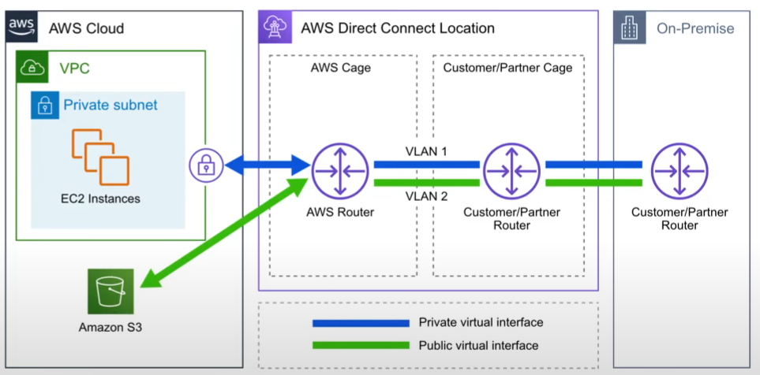

# AWS Direct Connect

Private/dedicated network connection b/w your office/ datacenter co-location and AWS

2 Options - two very fast network connection options

- Lower bandwidth - 50 MBps - 500 MBps
- Higher Bandwidth - 1 GBps - 10 GBps

## Advantages

- helps reduce Network costs and increase bandwidth throughput (great for high traffic networks)
- provides a more consistent Network experience than a typical internet-based connection (reliable and secure)

Note:  collocation or a carrier hotel is a data center where equipment, space and bandwidth are available for rental uh to retail customers

## Direct Cnnect Locations

direct connect location are trusted partner data centers that you can establish a dedicated highspeed low latency connection from your on- premise to AWS
Eg. Allied Data Centres - 250 Front Street West, Toronto
YOu would use the AWS direct connect service to order and establish the connection
