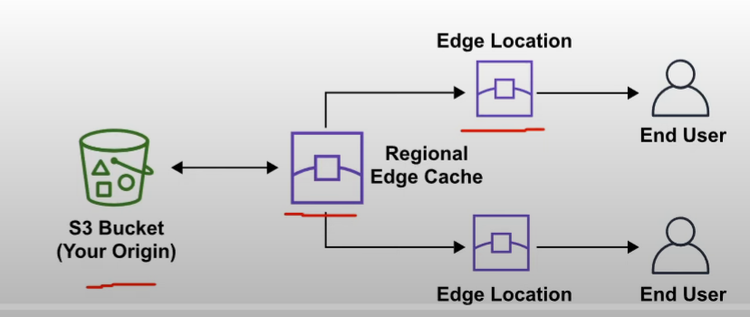
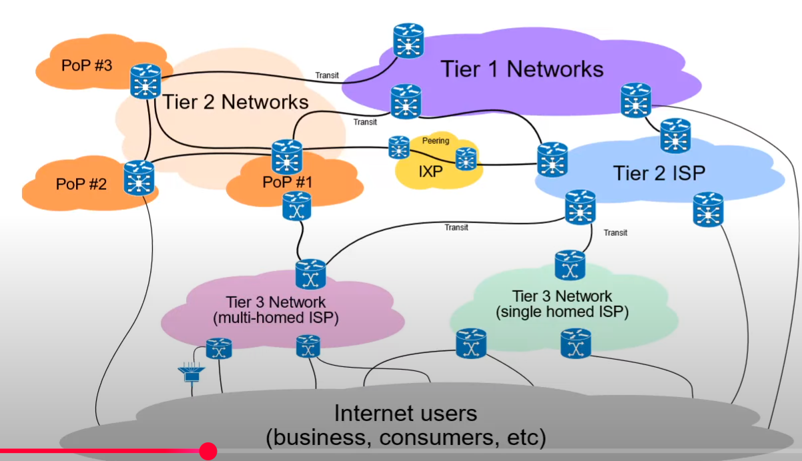

# AWS Global Infrastructure

Globally distributed hardware and datacenter that are physically networked together to act as one large resource for the end customer.

The day I made this:
- Launched region - 36
- Availability ZOne - 114
- 700+ CloudFront POPs (Point of Presence) and 13 Regional edge caches
- 135 Direct Connect locations
- 245 countries and territories served
- 43 Local Zones, 31 Wavelength Zones for ultralow-latency applications

## Regions

- Geographically distinct locations consisting of one or more availability zone. Every region is phisically isolated from and independent of every other region by location, power andd water supply
- AWS first region - 2006 - us-east1 (N. Virginia)
- Each region generally has 3 availability zone
	- some new users are limited to two eg. US-West
- new Services almost always become available first in Us East
-  not all services are available in all regions
- all your billing information appears in Us East one
- The cost of AWS Services vary per region
- 4 factors to look for
	- what are the Regulatory Compliance does this region meet 
	- what is the cost of this aws service in this region 
	- what AWS services are available in this region 
	- what is the distance distance or latency to my end users

## Regional Services

- AWS scopes their AWS management console on a selected region
- This determine where the AWS service is launched and what will be seen within the service
- You usually dont set the region for service at the time of creation

## Global service

- Services operate across multiple Reg and the region will be fixed to the word Global 
eg. Amazon S3, cloudfront, Route 53, IAM

## Availability Zone

- Physical location made up of one or more datacenter
- Secure building that contains hindreds of thousands of computers
- A region generally* has 3 AZ
- Datacenter within a region will be isolated from each other, they will be close enough to provide low latency(<10ms)
- Common practice to run in 3 AZ, to ensure that services remain available in case of on or two datacenter fail (High availability)
- AZ represented by region code followed by a letter identifier - us-east1a
- Subnet is associated with AZ.
- You never choose AZ while launcing resource, you choose the subnet which is associated with AZ.
- Us-east 1 has 6 Availability zone (this is the highest)

## Small example

- EC2 - Launch in a region and you select a AZ(which is a subnet)
- S3 - Global , but when you launch, we select a region
- Cloudfront - Global, but when you create, you create a geographical distribution - such as all or asia or europe or america like that 
- IAM - There is nothing

## Fault tolerance

- Fault domain - Section of network that is vulnerable to damage if a critical system fails. The purpose is that if a failure occurs, it will not cascade outside the domain, limiting the damage. 
- You can gave fault domains nested inside fault domains
- Fault level - Collection of fault domains
- the scoping of a fault domain could be something like a 
	- specific specific servers in a rack
	- an entire Rack in a data center 
	- an entire room in a datacenter
	- the entire data set are building and 
	- it's really up to the cloud service provider to define those boundaries of a domain
-  each Amazon region is designed to be completely isolated from the other Amazon region T
	-This achieves the greatest possible fault tolerance and stability 
- each availability zone is also isolated but the availability Zone in a region are connected through low latency links 
- each availability zone is designed as an independent failure Zone - A failure zone is AWS describing a fault domain

## Failure zone

- availability zones are physically separated within a typical Metropolitan region and are located in lower risk flood planes 
- discret uninterruptible power supply UPS and an on-site backup uh generation facilities 
- Data Centers located in different azs are uh designed to be supplied by independent substations to reduce the risk of an event on the power grid impacting more than one availability Zone 
- availability zones are all redundantly connected to multiple tier one Transit providers 
- multi-az for high availability - so if an application is partitioned across A's companies are better isolated and protected from issues such as power outages lightning strikes tornadoes earthquakes and more

## Global Network

- Interconnection b/w AWS infrastructure
- commonly referred to as the backbone of AWS - private express way where things can move fast between data centers 
- Edge location : Act as an on and off ramps to the AWS global network
- On -> AWS global accelerator, AWS S3 transfer acceleration - Use edge locations as an on-ramp to quickly reach AWS resources in other regions by traversing the fast AWS global network.
- Off -> AWS CDN - Use edge locations as an off-ramp to provide at the edge storage and compute near the user.
- VPC Endpoints - Ensures your resources stay with in the AWS network and donot traverse over public internet

## Point of Presence
- intermediate location between an AWS region and the end user and this location could be a data center or a collection of Hardware 
- For AWS a point of presence is a data center owned by AWS or trusted partner that is utilized by AWS Services related for Content delivery or expediated upload
- pop res could be something like an edge location or Regional Edge cache

- edge location are data centers that hold cache copies on the most popular files - web pages, images and videos - so that the delivery of the distance to the end users are reduced
- Regional Edge locations are data centers that hold much larger caches of less popular files to reduce a full round trip and also to reduce the cost of transfer fees

- POP is ath the edge/intersection of networks
- Tier 1 network - Can reach every other network on the internet wothout purchasing IP transit or paying for peering.
- AWS availability zone are all redundantly connected to multiple tier - 1 transit providers

- some services that are utilizing pops or Edge locations for Content delivery or expediated upload.
	- Amazon cloudfront is a Content delivery network service and the idea here you point your website to cloudfront so that it will route requests to the nearest Edge location cache 
		- allow you to choose an origin so that could be a web server or storage that will be the source of the cache
		- cache is the content of what origin would return to various Edge locations around the world

	- Amazon S3 transfer acceleration this allows you to generate a special URL that can be used by the end users to upload files to a nearby Edge location once a file is uploaded to an edge location it can move much faster within the AWS network to reach S3 

	- Global accelerator you can find the optimal path from the end user to your web servers so Global accelerators are deployed within Edge location so you send user traffic to an edge location instead of directly to your web application

## AWS Local zones

Datacenteres located close very close to a densely populated area to provide a single digit millisecond low latency performance(7 ms) for that area.
- Los Angles, CA was the first local zone to be deployed
	- Logical extension of US-West region
	- Id: us-west2-lax-1a
-Only specific AWS has been made available
	- EC2 instances (T3, C5, R5, R5d, I3en, G4)
	- EBS (io1, gp2)
	- AWS FSx
	- Application load balancer
	- VPC
- Purpose - support highly demanding applications sensitive to latencies - Media and entertainment, Electronic design automation, Ad-Tech, Mechine learning
- To use local zone, you need to opt in

## Wavelength Zone

- Allows for edge computing on 5G network
- Application will have ultra-low latency being as close as possible to the users.
- AWS has partnered with various telecom companies to utilize the 5G network. - Verizon, vodafone, sk telecom
- Create a subnet tied to Wavelength zone and then you can launch VM to the edge of the targeted 5G networks.

## AWS for government

- Public sector - military, law enforcement, infrastructure, public transit, public education, health care, the governmtn
- AWS can be used by public sector r organizations developing cloud for public sector
- AWS acheives this by regulatory compliance program along with specific governance and security controls
- AWS has special region for US regulation called GovCloud
- FedRAMP - provides a standard approach to security assessment, authorization, continous monitoring for cloud product and management.

## GovCloud

- Govcloud - CSP generally will offer an isolated region to run FedRAMP workloads
- AWS govcloud regions are specialized regions that allow customers to host sensitive controlled unclassified information and other types of regulated workloads
- govcloud regions are only operated by US citizens on us soil 
- they are only accessible to us entries and root account holders who pass a screening process. customers can architect secure Cloud solutions that comply with 
	- fed ramp high baseline 
	- the doj's criminal justice Information Systems security policy 
	- the US International traffic in arms regulation 
	- export Administration regulations 
	- the Department of Defense cloud computing security requirements and guides

## AWS in china

- AWS china - AWS cloud offerings in Mainland China
- AWS china is completely isolate intentionally from AWS global to meet regulatory compliance for mainland china
- AWS china - own domain - amazonaws.cn

- To operate in china - need licence (ICP lisence)
- Not all service are available (Route 53)
- RUnning in mainland china not singapore means you wouldnot need to traverse the great firewall.
- Two in mainland china - Ningxia cn-northwest-1 by NSWCF and cn-north-1 by SINNET

## Sustainability

- Climate pledge to achieve Net-Zero Carbon emissions by 2040 across all of AWS
- 3 parts
	- Renewable Energy - AWS is working towards having their AWS Global infrastructure powered by 100% renewable energy by 2025 and purchases and retires environmental attributes to cover the non-renewable energy for AWS Global infrastructure so they would purchase things like renewable energy credits and Rec's guarantees of Origins

	- cloud efficiency so AWS infrastructure is 3.6 times more energy efficient than the medium of us Enterprises data surveyed

	- water stewardship direct evaporative technology to cool our data centers. use of non portable water for cooling purposes (recycling water). on-site water treatment allows us to remove us them to remove scale forming minerals and reuse Waters for more Cycles. water efficiency metrics to determine and monitor optimal water use for each AWS region

See: [Sustainability](https://aws.amazon.com/sustainability/)
