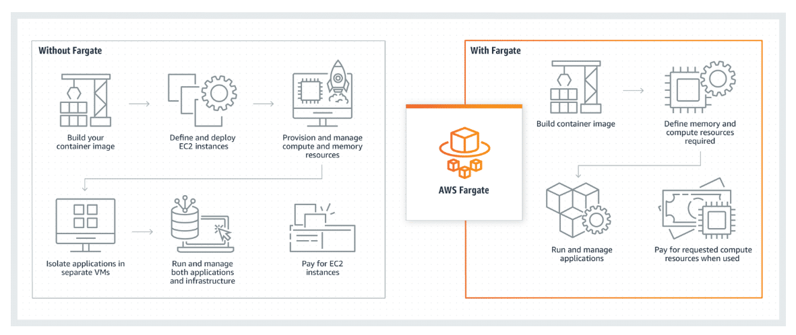

# AWS Fargate

Fargate is a serverless compute engine for containers that works with both Amazon Elastic Container Service (Amazon ECS) and Amazon Elastic Kubernetes Service (Amazon EKS).
With Fargate, you can focus on building your applications by eliminating the need to provision and manage virtual machines. 
Configure and pay for compute resources on a per-application basis while also improving your security posture with application isolation by design.

Meaning: Focus on your application. Define your application content, network, storage and scaling without any infrastructure management required. 

## "Q: How does AWS Fargate work with Amazon ECS and Amazon EKS?"
"Amazon Elastic Container Service (ECS) is a highly scalable, high performance container management service that supports Docker containers and Amazon EKS is fully managed Kubernetes Service. Both ECS and EKS use containers provisioned by Fargate to automatically scale, load balance, and manage scheduling of your containers for availability, providing an easier way to build and operate containerized applications."

## How much does Fargate cost?

With AWS Fargate, there are no upfront costs and you pay only for the resources you use. You pay for the amount of vCPU, memory, and storage resources consumed by your containerized applications running on Amazon Elastic Container Service (ECS) or Amazon Elastic Kubernetes Service (EKS).
Additionally, the default 20 GB of ephemeral storage may be optionally expanded to up to 200 GB for an additional per-gigabyte fee.

## Q: How should I choose when to use AWS Fargate?
Choose AWS Fargate to launch their containers without having to provision or manage EC2 instances. If you require greater control of your EC2 instances to support compliance and governance requirements or broader customization options, then use ECS or EKS without Fargate. Use EC2 for GPU workloads, which are not supported on Fargate today."

## How is deploying Amazon ECS on Fargate different than with Amazon Elastic Compute Cloud (Amazon EC2)?

- **Be aware of networking** : While Amazon ECS workloads on Amazon EC2 can use networking modes such as awsvpc, bridge, host, or none, Amazon ECS using Fargate is optimized for use with awsvpc. With each task based on Fargate that receives its own elastic network interface and IP address, ensure that the target virtual private cloud (VPC) has sufficiently available IP addresses in its Classless Inter-Domain Routing (CIDR).

- **Rightsize Fargate configurations** : Running disparate workloads on the same Amazon EC2 node can present an initial challenge when operating the same workload in Fargate. You will have to specify an exact count for vCPU and memory at the Amazon ECS service level rather than the Amazon EC2 host level. Use existing application performance monitoring (APM) tooling, if available, to ascertain the optimal configuration. Alternatively, configure Fargate conservatively. Then, decrease resources after running the workload for long enough that resourcing requirements become understood.

- **Optimize spending with compute options** : An array of options is available for Fargate workloads seeking to optimize spend. While On-Demand Instances are available by default, explore whether a given workload could accommodate the use of Spot Instances. Graviton2 is available for Amazon ECS, and Fargate and Compute Savings Plans can be layered in for additional savings. Blend these available options to efficiently balance compute needs with spend.

- **Use platform versions** : Fargate platform versions are used to refer to a specific runtime environment for Fargate task infrastructure. They combine the kernel and container runtime versions. While these versions rarely change, using the latest version will provide the widest support for new capabilities and features.

- **Set up seamless auto scaling** : In a traditional container environment, an operator has to manage scaling at both the container layer and the underlying infrastructure host layer. Fargate helps this experience by handling the infrastructure layer on behalf of customers. Amazon ECS provides several options for auto scaling, including target tracking scaling policies, step scaling policies, and scheduled scaling. These can be configured on a per-service basis to best align with a given workload’s requirements.

## What problems does Fargate solve?

Fargate provides a holistic suite of capabilities aimed at bringing a serverless operating model into containerized workloads. Features such as auto scaling, evergreen patching of underlying instances, and persistent storage options provide a robust, broad set of abilities that aligns with diverse workloads. Abstracting the minutiae of virtual machine infrastructure frees development and operations teams to innovate more quickly and focus on higher-value activities for their own customers.

Fargate helps you to:

- Spend time deploying and managing infrastructure and optimize spending by supporting Spot Instances, Compute Savings Plans, and AWS Graviton2 processors.
- Secure containers through the use of a hardened environment that restricts privileged containers and host mounts, deploying each workload in an isolated micro-virtual machine away from other workloads. 
- Store data with 20 GB of local ephemeral storage by default that can be expanded and also persistent storage integration with Amazon Elastic File System (Amazon EFS).
- Consider compliance standards such as the Payment Card Industry Data Security Standard (PCI DSS), Health Insurance Portability and Accountability Act (HIPAA), Systems and Organization Controls 2 (SOC 2), and more.

NOTE: Fargate provides a holistic suite of capabilities aimed at bringing a serverless operating model into containerized workloads.

## How is Fargate used to architect a cloud solution?

After a container orchestrator such as Amazon ECS or Amazon EKS is chosen, Fargate may then be selected as the compute layer for a workload. Fargate may also be used in conjunction with Amazon EC2 for compute through the Amazon ECS capacity provider feature, or on a per-namespace basis in Amazon EKS.

## What are the basic technical concepts of Fargate?

Fargate can be used as a serverless compute layer for either Amazon ECS or Amazon EKS. For this guide, you will focus on Amazon ECS. Users of Fargate should have a basic understanding of the following concepts. To learn more about the basics of Fargate, choose from the following six sections.

- Clusters : An Amazon ECS cluster is a logical grouping of tasks or services. You can use clusters to isolate your applications. This way, they don't use the same underlying infrastructure. When your tasks are run on Fargate, the service also manages your cluster resources.

- Containers and images : To deploy applications on Amazon ECS, your application components must be configured to run in containers. A container is a standardized unit of software development that holds everything that your software application requires to run. This includes relevant code, runtime, system tools, and system libraries. Containers are created from a read-only template called an image.
Images are typically built from a Dockerfile. A Dockerfile is a plaintext file that specifies all of the components that are included in the container. After they are built, these images are stored in a registry from which they can be downloaded. Then, after you download them, you can use them to run on your cluster. For more information about container technology, see Docker basics for Amazon ECS.

- Task definitions : A task definition is a text file in JSON format that describes one or more containers that form your application. You can use it to describe up to a maximum of 10 containers. The task definition functions as a blueprint for your application, specifying parameters. For example, you can use it to specify parameters for the operating system, which containers to use, which ports to open for your application, and what data volumes to use with the containers in the task. The parameters available for your task definition depend on the needs of your specific application.
Your entire application stack doesn't need to be on a single task definition. In fact, we recommend spanning your application across multiple task definitions. You can do this by combining related containers into their own task definitions, each representing a single component.

- Tasks : A task is the instantiation of a task definition in a cluster. After you create a task definition for your application in Amazon ECS, you can specify the number of tasks to run on your cluster. You can run a standalone task, or you can run a task as part of a service.

- Services : You can use an Amazon ECS service to run and maintain your desired number of tasks simultaneously in an Amazon ECS cluster. How it works is that, if any of your tasks fail or stop for any reason, the Amazon ECS service scheduler launches another instance based on your task definition. It does this to replace it and thereby maintain your desired number of tasks in the service.

